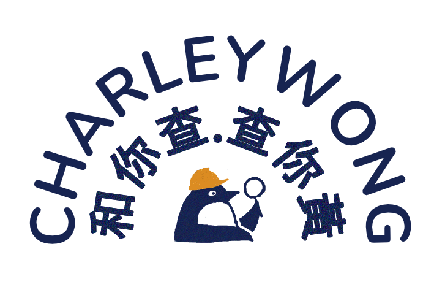

<p align="center">

</p>

A Yellow Economic Circle business/brand database released with [open source / open data licenses](LICENSE). Currently only pro-democracy entities are recorded.

[charleywong.giffon.io](https://charleywong.giffon.io/) is a simple read-only web interface of the database. It also serves as an API endpoint (CORS enabled, no authentication needed). Check the "JSON" links in the entity pages, search result pages, and the [list all](https://charleywong.giffon.io/list/all) page.

## Technical overview

Data is stored as JSON files in the [data](data) directory.

```jsonc
{
  // an unique string with A-Z, a-z, 0-9, dot (.), hyhen (-), underscore (_)
  // usually the same as the enitity's social media handle
  "id": "giffon.io",

  // an object with "en"/"zh" keys with the enitity's English/Chinese name, respectively
  "name": {
    "en": "Giffon"
  },
  
  // "official" websites or social media accounts
  "webpages": [
    {
      "url": "https://giffon.io"
    },
    {
      "url": "https://www.facebook.com/giffon.io/",

      // optional "meta", should be collected automatically with our import tool
      // just leave it out during manual edit
      "meta": {
        "about": "A crowd-gifting platform where you can state what you want and let your friends collectively buy it as a gift for you.\n\n任何人都可以上嚟許願, 等朋友夾份買禮物送俾你嘅禮物眾籌平台.",
        "categories": [
          "App Page",
          "Website"
        ],
        "email": "admin@giffon.io",
        "id": "255097848528810"
      },
    }
  ],

  // social media posts or news articles about the entity's political stance
  // e.g. slogans, statements, donation (with proofs or not), protest-releated media, re-posts of articles etc.
  // non-exhaustive, should be under 10 for easier maintenance
  // prefer early and/or popular posts
  "posts": [
    {
      "url": "https://www.facebook.com/giffon.io/photos/a.496357477736178/497258487646077",

      // again, optional "meta" similar to those of "webpages"
      "meta": {
        "utime": "1581328986",
        "sharedWith": "Public"
      }
    },
  ],
  
  // for discoverability
  // see "src/charleywong/Tag.hx" for possible values
  "tags": [
    "shop"
  ]
}
```

The web interface is a [React](https://reactjs.org/) / [Express](https://expressjs.com/) app hosted by [AWS Lambda](https://aws.amazon.com/lambda/), backed by [Cloudflare](https://www.cloudflare.com/).

All program source code are written in [Haxe](https://haxe.org/). Our dev environment is [Visual Studio Code](https://code.visualstudio.com/) with its [remote containers extension](https://code.visualstudio.com/docs/remote/containers).

Open the checked out the source code (with git submodules) using Code, with dev container. Run `haxe build.hxml` to build the web interface. Use `yarn start` to run locally.

To update chrome extension, run `haxe chrome-extension.hxml`, open Chrome and go to Extension page(chrome://extensions) and reload Charley.